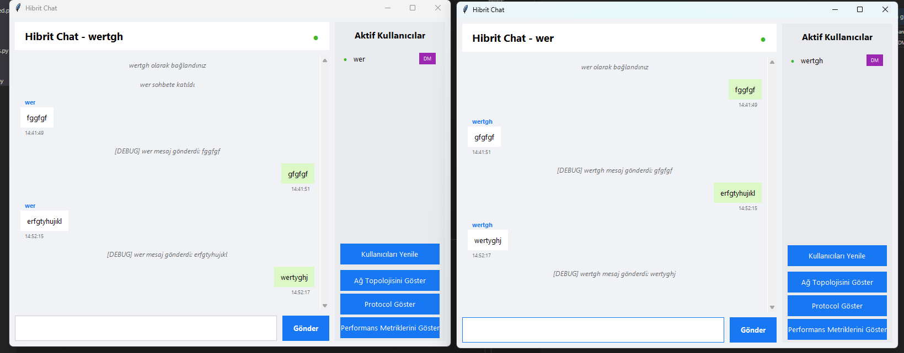
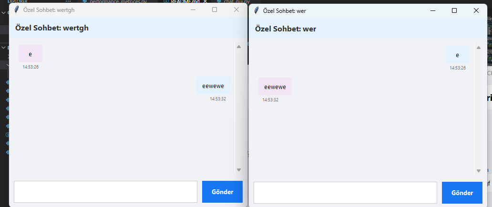
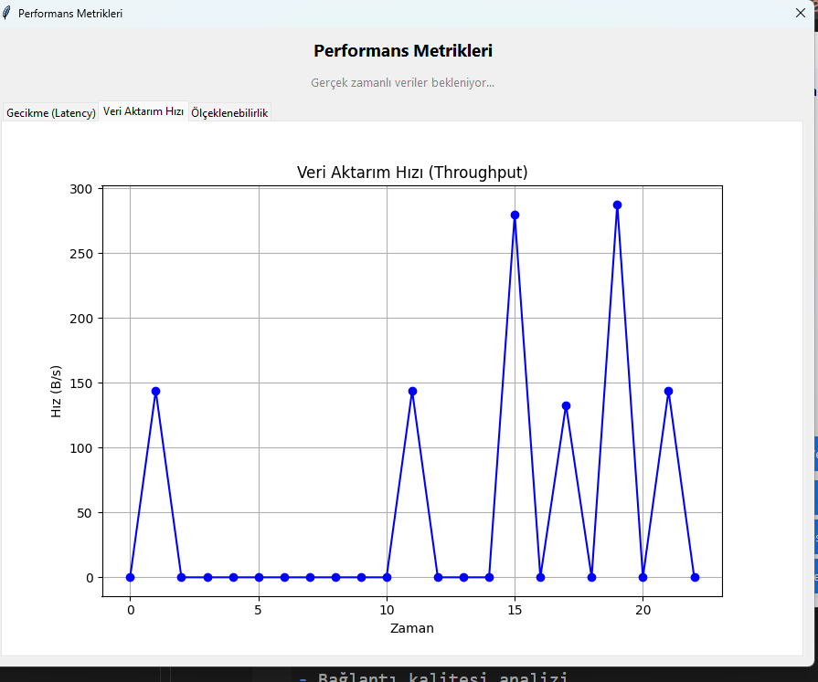

# Real time  Chat Uygulaması

Real time chat app TCP ve UDP protokollerini birlikte kullanarak güvenilir ve performanslı bir sohbet deneyimi sunan modern bir network uygulamasıdır. Bu proje, ağ programlama prensiplerini göstermek ve gerçek zamanlı performans analizi yapmak amacıyla geliştirilmiştir.

## 🚀 Özellikler

### Core Özellikler
- **Hibrit Protokol Mimarisi**: TCP (güvenilir bağlantılar) + UDP (hızlı mesajlaşma)
- **Gerçek Zamanlı Sohbet**: Anlık mesajlaşma ve kullanıcı durumu takibi
- **Özel Mesajlaşma**: Kullanıcılar arası direkt mesajlaşma sistemi
- **Kullanıcı Yönetimi**: Aktif kullanıcı listesi ve durum gösterimi

### Görselleştirme ve Analiz
- **Ağ Topolojisi Görüntüleyici**: Gerçek zamanlı ağ yapısı ve bağlantı kalitesi
- **Performans Metrikleri**: Gecikme, veri aktarım hızı ve ölçeklenebilirlik analizi
- **Protokol Monitörü**: JSON formatında protokol mesajlarının izlenmesi

### Modern UI/UX
- **Modern Tasarım**: Kullanıcı dostu arayüz ve renk şeması
- **Responsive Layout**: Pencere boyutlarına uyumlu tasarım
- **Çoklu Pencere Desteği**: Özel sohbet pencereleri

## 📸 Ekran Görüntüleri

<div align="center">
  
  
</div>

<div align="center">
  
  
</div>

## 📋 Sistem Gereksinimleri

### Gerekli Python Paketleri
```
tkinter (GUI framework)
matplotlib (grafik görselleştirme)
threading (çoklu işlem desteği)
socket (ağ iletişimi)
json (veri formatı)
time, datetime (zaman işlemleri)
hashlib (veri bütünlüğü)
colorsys (renk hesaplamaları)
```

### Sistem Gereksinimleri
- Python 3.7+
- Windows/Linux/macOS
- Minimum 512MB RAM
- Ağ bağlantısı (LAN/WAN)

## 🏗️ Mimari Yapı

### 1. Hibrit Protokol (hybrid_protocol.py)
```python
class ChatProtocol:
    # Mesaj Tipleri
    MSG_AUTH = "AUTH"        # Kimlik doğrulama (TCP)
    MSG_CHAT = "CHAT"        # Sohbet mesajı (UDP)
    MSG_ACK = "ACK"          # Onay mesajı (UDP)
    MSG_USERS = "USERS"      # Kullanıcı listesi (TCP)
    MSG_DIRECT = "DIRECT"    # Özel mesaj (UDP)
    MSG_PING = "PING"        # Gecikme ölçümü (UDP)
    MSG_PONG = "PONG"        # Gecikme yanıtı (UDP)
    MSG_TOPO = "TOPO"        # Topoloji bilgisi (TCP)
```

**Özellikler:**
- JSON tabanlı mesaj formatı
- SHA-256 checksum ile veri bütünlüğü
- Timestamp ve mesaj ID sistemi

### 2. Sunucu (hybrid_server.py)
```python
class HybridChatServer:
    def __init__(self, tcp_port=12345, udp_port=12346):
        # TCP: Güvenilir bağlantılar için
        # UDP: Hızlı mesajlaşma için
```

**Sorumluluklar:**
- Kullanıcı kimlik doğrulama ve yönetimi
- Mesaj yönlendirme ve yayınlama
- Topoloji verisi toplama ve dağıtma
- Ping/Pong işlemleri için yanıt verme

### 3. İstemci (hybrid_chat_client_fixed.py)
```python
class HybridChatClient:
    def __init__(self, server_ip="127.0.0.1", tcp_port=12345, udp_port=12346):
        # Çift soket yapısı
        self.tcp_socket = socket.socket(socket.AF_INET, socket.SOCK_STREAM)
        self.udp_socket = socket.socket(socket.AF_INET, socket.SOCK_DGRAM)
```

**Özellikler:**
- Asenkron mesaj gönderme/alma
- ACK tabanlı güvenilir UDP
- Otomatik yeniden gönderme mekanizması
- Performans metrikleri toplama

### 4. GUI (chat_gui.py)
```python
class ModernChatGUI:
    def __init__(self):
        # Modern tasarım elementi
        self.colors = {
            "bg": "#f0f2f5",
            "primary": "#1877f2",
            "my_message": "#dcf8c6",
            "other_message": "#ffffff"
        }
```

**Bileşenler:**
- Ana sohbet alanı (scrollable)
- Kullanıcı listesi (sağ panel)
- Mesaj giriş alanı
- Durum gösterges

## 📊 Performans Analizi

### 1. Performans Metrikleri (performance_metrices.py)

#### Gecikme (Latency) Analizi
```python
def record_latency(self, username, latency_ms):
    """Kullanıcı bazında gecikme verilerini toplar"""
    # Ping-Pong döngüsü ile ölçüm
    # Grafik gösterim ve istatistikler
```

#### Veri Aktarım Hızı (Throughput)
```python
def calculate_throughput(self):
    """Saniye başı byte cinsinden veri hızını hesaplar"""
    total_bytes = self.bytes_sent + self.bytes_received
    throughput = total_bytes / time_diff
```

#### Ölçeklenebilirlik (Scalability)
```python
def record_user_count(self, count):
    """Aktif kullanıcı sayısını izler"""
    # Zaman serisi analizi
    # Maksimum/ortalama kullanıcı istatistikleri
```

### 2. Grafik Görselleştirme
- **Matplotlib Entegrasyonu**: Gerçek zamanlı grafik güncelleme
- **Çoklu Sekme Yapısı**: Gecikme, throughput ve scalability ayrı sekmeler
- **Otomatik Yenileme**: 1-10 saniye arası ayarlanabilir yenileme

## 🌐 Ağ Topolojisi

### 1. Topoloji Görselleştirme (topology_view_fixed.py)
```python
class TopologyView:
    def update_topology(self, topology_data):
        """Ağ düğümlerini ve bağlantıları görselleştirir"""
        # Düğüm pozisyonları (daire düzeninde)
        # Bağlantı kalitesi (renk kodlaması)
        # Gecikme gösterimi
```

**Özellikler:**
- Dinamik düğüm yerleşimi
- Renk kodlu gecikme gösterimi (yeşil: düşük, kırmızı: yüksek)
- Bağlantı kalitesi çizgileri
- Tooltip ile detaylı bilgi

### 2. Topoloji Veri Toplama (network_topology.py)
```python
class NetworkTopology:
    def add_or_update_node(self, username, ip, port, latency=None):
        """Düğüm bilgilerini günceller"""
    
    def update_connection_quality(self, from_user, to_user, quality):
        """Bağlantı kalitesini hesaplar"""
```

## 🔧 Kurulum ve Çalıştırma

### 1. Depoyu Klonlayın
```bash
git clone https://github.com/rumeysa111/reail-time-chat-room-.git

```

### 2. Gerekli Paketleri Yükleyin
```bash
pip install matplotlib
# tkinter genellikle Python ile birlikte gelir
```

### 3. Sunucuyu Başlatın
```bash
python hybrid_server.py
```
Çıktı:
```
Sunucu başlatıldı. TCP port: 12345, UDP port: 12346
Bağlantılar bekleniyor...
```

### 4. İstemciyi Başlatın
```bash
python chat_gui.py
```

### 5. Kullanıcı Adı Girin
- Açılan diyalog kutusuna kullanıcı adınızı girin
- Bağlantı durumu üst sağ köşede gösterilir:
  - 🟢 Yeşil: Bağlı
  - 🟡 Sarı: Bağlanıyor
  - 🔴 Kırmızı: Bağlantı hatası

## 📖 Kullanım Kılavuzu

### Temel Sohbet
1. **Mesaj Gönderme**: Alt kısımdaki metin kutusuna yazıp Enter'a basın
2. **Kullanıcı Listesi**: Sağ panelde aktif kullanıcıları görün
3. **Özel Mesaj**: Kullanıcı adına sağ tıklayıp "DM" butonuna basın

### Özel Mesajlaşma
1. Kullanıcı listesinden bir kullanıcıya tıklayın
2. "DM" butonuna basın veya sağ tıklayıp "Özel Mesaj Gönder" seçin
3. Açılan yeni pencerede özel sohbet yapın
4. Gelen özel mesajlar için bildirim alırsınız

### Ağ Topolojisi Görüntüleme
1. **"Ağ Topolojisini Göster"** butonuna tıklayın
2. **Özellikler:**
   - Düğümler: Kullanıcıları temsil eder
   - Renkler: Gecikme süresi (yeşil=düşük, kırmızı=yüksek)
   - Çizgiler: Bağlantı kalitesi
   - Otomatik yenileme: 3-30 saniye arası ayarlanabilir

3. **Kontrol Düğmeleri:**
   - "Topolojiyi Güncelle": Manuel güncelleme
   - "Ping Gönder": Sunucuya ping
   - "Tüm Kullanıcılara Ping": Tüm kullanıcılara ping

### Performans Metrikleri
1. **"Performans Metriklerini Göster"** butonuna tıklayın
2. **Sekmeler:**
   - **Gecikme (Latency)**: Kullanıcı bazında ping süreleri
   - **Veri Aktarım Hızı**: Saniye başı byte cinsinden throughput
   - **Ölçeklenebilirlik**: Aktif kullanıcı sayısı değişimi

3. **Kontroller:**
   - Otomatik yenileme: Açık/kapalı
   - Yenileme aralığı: 1-10 saniye
   - Manuel yenileme düğmesi

### Protokol İzleme
1. **"Protocol Göster"** butonuna tıklayın
2. Tüm gelen/giden mesajları JSON formatında görün
3. Mesaj tipleri ve içerikleri detaylı olarak incelenir

## 🔍 Teknik Detaylar

### Güvenilir UDP İmplementasyonu
```python
class ReliableUDP:
    def __init__(self, sock, window_size=5, timeout=1.0, max_retries=3):
        # Sliding window protokolü
        # ACK tabanlı onaylama
        # Otomatik yeniden gönderme
```

**Özellikler:**
- Sliding window (pencere boyutu: 5)
- Timeout: 1 saniye
- Maksimum yeniden deneme: 3
- Sıra numarası kontrolü
- Mesaj tamponlama

### Mesaj Güvenliği
```python
def _generate_checksum(message):
    """SHA-256 tabanlı mesaj bütünlüğü kontrolü"""
    message_str = json.dumps(message, sort_keys=True)
    checksum = hashlib.sha256(message_str.encode()).digest()
    return base64.b64encode(checksum).decode()[:12]
```

### Thread Güvenliği
- `threading.Lock()` ile kritik bölümler korunur
- GUI güncellemeleri ana thread'de yapılır
- Ağ işlemleri ayrı thread'lerde çalışır

## 🐛 Bilinen Sınırlamalar

1. **Platform Bağımlılığı**: Windows'ta test edilmiştir
2. **Matplotlib Bağımlılığı**: Yoksa sadece metin tabanlı metrikler
3. **Ağ Gecikmeleri**: Yüksek gecikmeli ağlarda performans düşebilir
4. **Bellek Kullanımı**: Uzun süreli kullanımda mesaj geçmişi birikir

## 🔧 Troubleshooting

### Bağlantı Sorunları
```
[ERROR] Bağlantı hatası: [Errno 10061] No connection could be made
```
**Çözüm:** Sunucunun çalıştığından ve port'ların açık olduğundan emin olun

### Matplotlib Hatası
```
[WARNING] Matplotlib import edilemedi
```
**Çözüm:** `pip install matplotlib` ile yükleyin

### UDP Mesaj Kayıpları
```
[ERROR] ACK alınamadı, yeniden gönderiliyor
```
**Çözüm:** Ağ bağlantınızı kontrol edin, timeout süresini artırın


## 👥 Katkıda Bulunma

1. Fork yapın
2. Feature branch oluşturun (`git checkout -b feature/yeni-ozellik`)
3. Değişikliklerinizi commit edin (`git commit -am 'Yeni özellik eklendi'`)
4. Branch'inizi push edin (`git push origin feature/yeni-ozellik`)
5. Pull Request oluşturun

